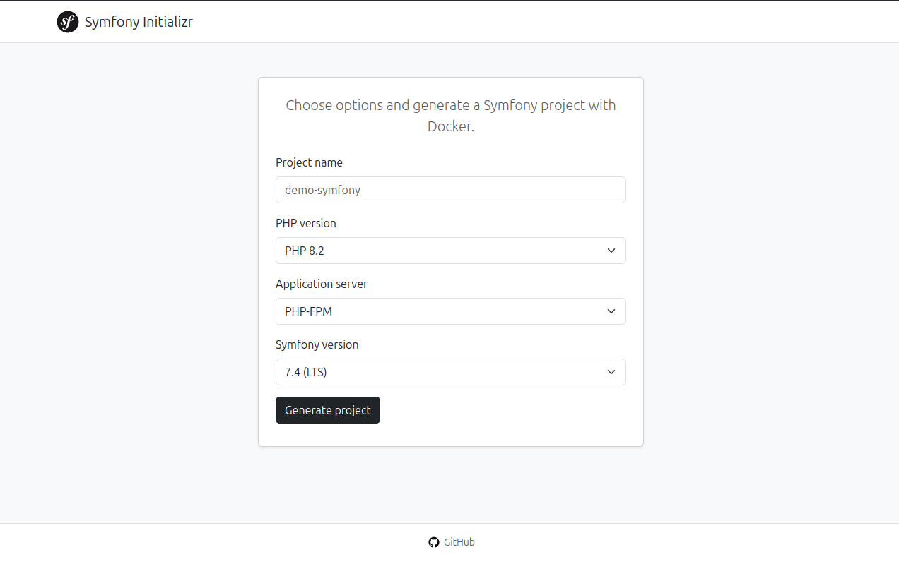

# Symfony Initializr

[](https://www.php.net/)
[](https://symfony.com/)
[](https://frankenphp.dev/)
[](https://www.docker.com/)

**Язык / Language:** [Русский](#russian) · [English](#english)

---

<a id="russian"></a>

## Веб-сервис генерации Symfony-проектов с Docker

Выберите нужные параметры проекта и получите ZIP-архив с готовым Symfony-приложением, которое можно сразу запустить с помощью `docker compose up`.

<p align="center">
  
</p>

---

## Возможности

- **Параметры проекта**: имя, версия PHP, сервер приложений (PHP-FPM + Nginx или FrankenPHP), версия Symfony (LTS и текущие — подгружаются с symfony.com).
- **База данных**: без БД, PostgreSQL, MySQL, MariaDB или SQLite. В Dockerfile автоматически подставляются нужные PHP-расширения (pdo_pgsql, pdo_mysql, pdo_sqlite).
- **Расширения Symfony**: Doctrine ORM, Mailer, Messenger, Security, Validator, Serializer — устанавливаются через `composer require` с версией, совместимой с выбранной версией Symfony.
- **Redis**: опция «Include Redis cache» добавляет расширение PHP `redis` и переменную `REDIS_URL` в `.env`.
- **Генерация**: скелет через `composer create-project`, подстановка Dockerfile (единый стиль, минимум слоёв), docker-compose, конфигурация веб-сервера (Nginx для FPM, Caddyfile для FrankenPHP). Если выбран Doctrine ORM и БД — рецепт добавляет сервис БД в docker-compose и при необходимости `DATABASE_URL` в `.env`; дубликаты не создаются.
- **Скачивание**: кнопка «Generate project» блокируется до завершения запроса; архив скачивается через fetch (без перезагрузки страницы). При превышении лимита запросов показывается сообщение и время повтора.
- **Кеширование**: результаты генерации кешируются по комбинации параметров (PHP, сервер, Symfony, расширения, БД, Redis), повторный запрос с теми же настройками отдаёт архив быстрее.
- **Лимит запросов**: 30 запросов в час на IP для эндпоинта генерации.

---

## Запуск

```bash
docker compose up -d --build
```

Сервис будет доступен по адресу: http://localhost:8080

Войти в контейнер:

```bash
docker compose exec frankenphp bash
```

---

## Разработка

Стиль кода проверяется и исправляется с помощью [PHP CS Fixer](https://github.com/PHP-CS-Fixer/PHP-CS-Fixer) (правила `@Symfony`). Конфигурация — `app/.php-cs-fixer.dist.php`. Запуск внутри контейнера (из каталога приложения):

```bash
docker compose exec frankenphp bash
./vendor/bin/php-cs-fixer fix src
```

Прогрев кеша версий PHP/Symfony и сгенерированных проектов (по желанию):

```bash
php bin/console app:warm-cache
```

---

<a id="english"></a>

## Web Service for Generating Symfony Projects with Docker

Choose the required project options and receive a ZIP archive with a ready-to-run Symfony application that can be launched immediately using `docker compose up`.

<p align="center">
  
</p>

---

## Features

- **Project parameters**: name, PHP version, application server (PHP-FPM + Nginx or FrankenPHP), Symfony version (LTS and current — fetched from symfony.com).
- **Database**: none, PostgreSQL, MySQL, MariaDB, or SQLite. The generated Dockerfile includes the matching PHP extensions (pdo_pgsql, pdo_mysql, pdo_sqlite).
- **Symfony extensions**: Doctrine ORM, Mailer, Messenger, Security, Validator, Serializer — installed via `composer require` with versions compatible to the selected Symfony version.
- **Redis**: the “Include Redis cache” option adds the PHP `redis` extension and `REDIS_URL` to `.env`.
- **Generation**: skeleton via `composer create-project`, injection of a single-style minimal-layer Dockerfile, docker-compose, and web server config (Nginx for FPM, Caddyfile for FrankenPHP). If Doctrine ORM and a database are selected, the recipe adds the DB service to docker-compose and `DATABASE_URL` to `.env` when needed; duplicates are avoided.
- **Download**: the “Generate project” button is disabled until the request completes; the archive is downloaded via fetch (no page reload). If the rate limit is exceeded, a message and retry time are shown.
- **Caching**: generation results are cached by the combination of options (PHP, server, Symfony, extensions, database, Redis); repeated requests with the same options return the archive faster.
- **Rate limit**: 30 requests per hour per IP for the generate endpoint.

---

## Running

```bash
docker compose up -d --build
```

The service will be available at: http://localhost:8080

Enter the container:

```bash
docker compose exec frankenphp bash
```

---

## Development

Code style is enforced with [PHP CS Fixer](https://github.com/PHP-CS-Fixer/PHP-CS-Fixer) using the `@Symfony` rule set. Config: `app/.php-cs-fixer.dist.php`. Run inside the container (from the app directory):

```bash
docker compose exec frankenphp bash
./vendor/bin/php-cs-fixer fix src
```

To warm the PHP/Symfony version cache and generated project cache (optional):

```bash
php bin/console app:warm-cache
```
